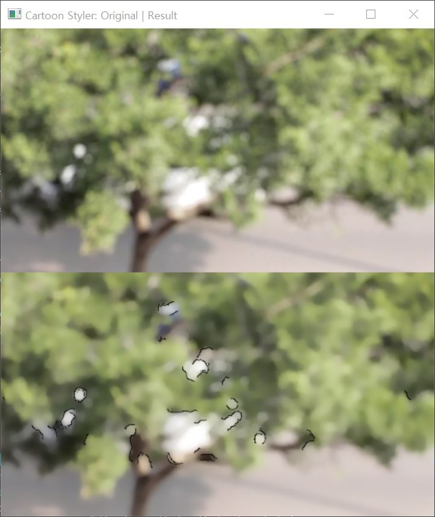

# Cartoon Styler

이 프로젝트는 OpenCV를 사용하여 주어진 비디오를 카툰 스타일로 변환하는 간단한 도구입니다. 이 도구를 사용하면 비디오의 각 프레임을 불러와 카툰 스타일로 처리한 후, 새로운 비디오 파일로 저장할 수 있습니다.

## 주요 기능

- 주어진 비디오 파일을 불러와 카툰 스타일로 변환합니다.
- 프로그램 실행 시 원본 비디오와 카툰 스타일로 변환된 비디오가 함께 표시되는 창이 나타납니다.
- 카툰 스타일로 처리된 비디오는 프로그램이 종료될 때까지 녹화되어 새로운 파일로 저장됩니다.

## 사용 방법

1. 프로젝트 디렉토리에 사용할 비디오 파일을 추가합니다.
2. `cartoon_styler.py` 스크립트 내에서 `video_file` 변수를 원하는 비디오 파일명으로 설정합니다.
3. 코드를 실행하여 비디오를 카툰 스타일로 변환합니다.
4. ESC 키를 누르거나 원본 비디오가 종료될 때까지 재생하면 프로그램이 종료됩니다.

## 이미지 추가 설명

### 카툰으로 잘 변환된 경우:

- 이 이미지는 카툰 스타일로 잘 변환된 예시입니다. 선명하고 명확한 카툰 효과가 적용되었습니다.
  (사용된 비디오 파일: office.mp4)

### 카툰으로 잘 변환되지 않은 경우:

- 이 이미지는 카툰 스타일로 잘 변환되지 않은 예시입니다. 흐릿하고 불분명한 효과가 적용되었습니다.
  (사용된 비디오 파일: traffic.mp4)
